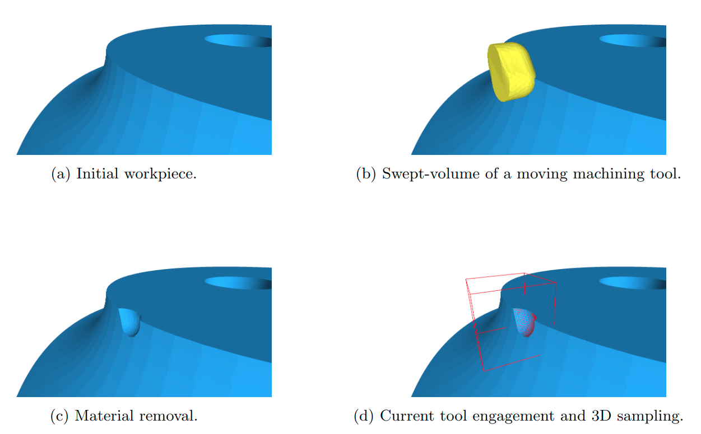

## Machining tool identification utilizing temporal 3D point clouds

<p>
	
</p>

This repository provides the code for our paper [Machining tool identification utilizing temporal 3D point clouds](https://doi.org/10.1007/s10845-023-02093-5)

Please consider citing this work if you find it influential or useful in your research.

```
@article{Zoumpekas2023JIMS,
author = {Zoumpekas, Thanasis and Leutgeb, Alexander and Puig, Anna and Salamó, Maria},
title = {Machining tool identification utilizing temporal 3D point clouds},
journal = {Journal of Intelligent Manufacturing},
doi = {10.1007/s10845-023-02093-5},
year = {2023}
}
```

## Installation

Please install [Python Poetry](https://python-poetry.org/).
Then simply run (inside the project directory):

```
poetry install
poetry shell
pip install torch==1.12.1+cu102 torchvision==0.13.1+cu102 torchaudio==0.12.1 --extra-index-url https://download.pytorch.org/whl/cu102

```

The code was tested with CUDA **10.2** and PyTorch **1.12.1** on Ubuntu Linux **20.04**.

## Usage 

If all the dependencies installed correctly then you can train and test new models from scratch.

### Datasets

The temporal 3D point clouds are available here: (TPCOMP dataset) https://doi.org/10.34810/data205

* 16 Tools Large Dataset: Please put it under ```data/16_Tools_Large_Dataset/'```
* 16 Tools Small Dataset: Please put it under ```data/16_Tools_Small_Dataset/'```

### Training 

```python train_classification_tools_L --model pointnet_cls --batch_size 8```

### Testing

```python test_classification_tools_L --log_dir "path_to_trained_model_log"```


Our code is mainly based on the following repository: https://github.com/yanx27/Pointnet_Pointnet2_pytorch

## License

MIT LICENSE.